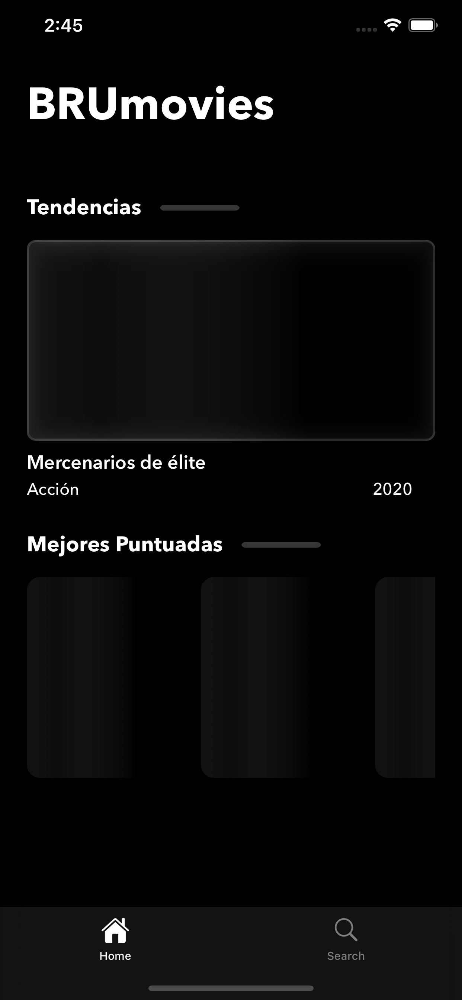
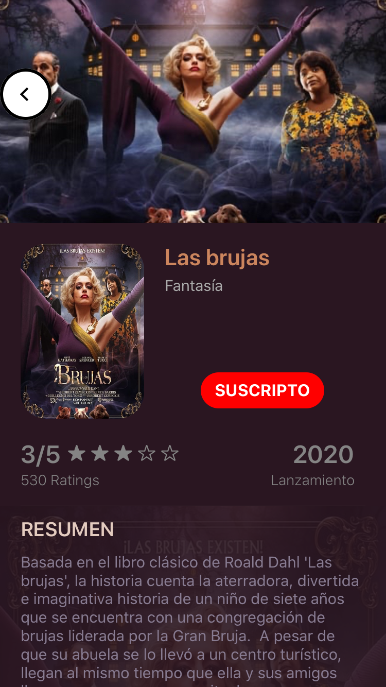
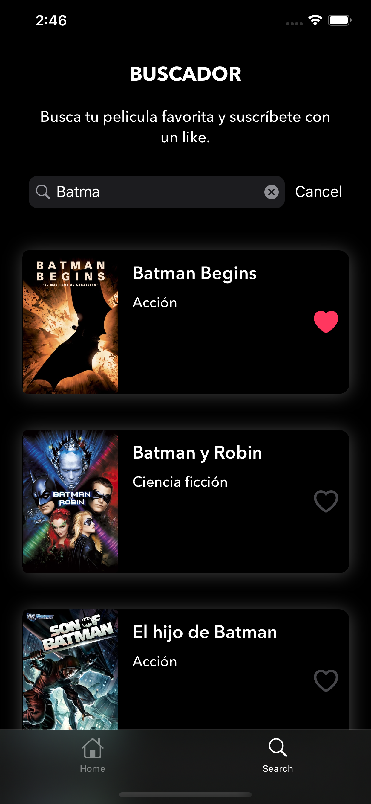
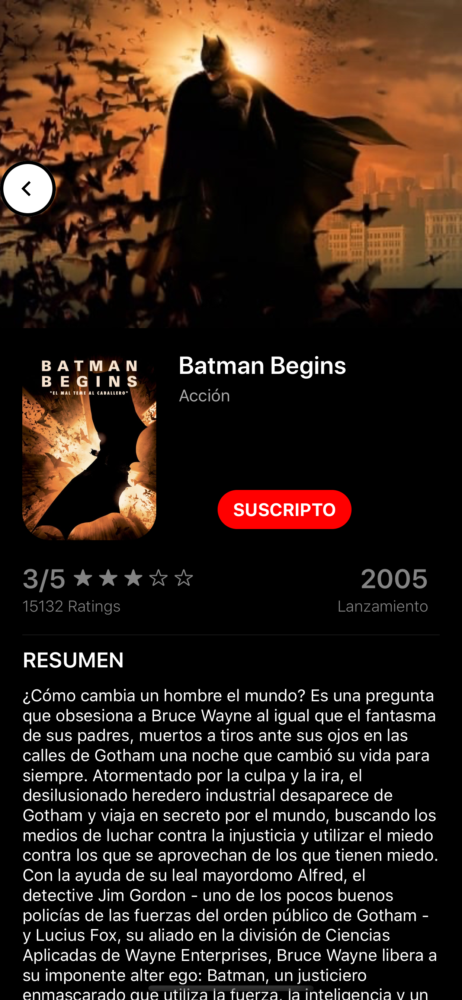
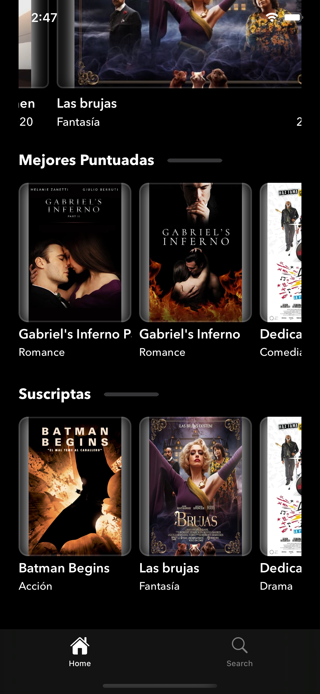

# BRUMovies - Desafio técnico

Aplicación destinada a usuarios que deseen tener informacion rápida sobre películas.
Permite visualizar galerias de peliculas que son tendencia, mejores puntuadas y una particular para que el usuario pueda almacenar peliculas a las que se suscriba.
Ofrece la funcionalidad de buscador para acceder de una forma mas rapida a la informacion

## Features
- Api Rest
- Soporte de modo oscuro 
- Buscador de peliculas
- Suscripcion y desuscripcion a peliculas
- Pantalla animada de carga
- CocoaPods
- UserDefaults
- File Manager
- URLSession

## ¿Cómo correr el proyecto?
Colocar la api key en BruMovies/Code/Services/NetworkManager

## Screenshots

***************

***************

***************

***************

***************

***************

***************

***************
